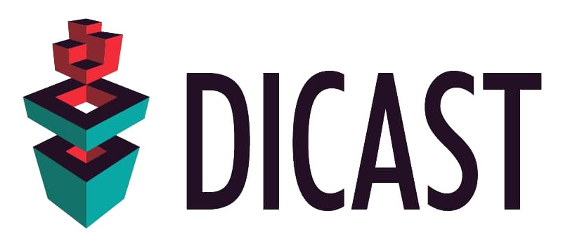

Alternative splicing is a major contributor to transcriptome and proteome diversity in health and disease. A plethora of tools have been developed for studying alternative splicing in RNA-seq data. Previous benchmarking efforts focused on isoform quantification and mapping, neglecting event detection tools which arguably provide the most detailed insights into the alternative splicing process. 

DICAST closes this gap by offering a modular and extensible alternative splicing framework integrating eleven splice-aware mapping and nine event detection tools, which we benchmark extensively on simulated as well as whole blood RNA-seq data. We further propose the first uniform reporting standard to unify existing formats and to guide future tool development. The performance of event detection tools varies widely with no tool outperforming all others. DICAST allows researchers to employ a consensus approach to consider the most successful tools jointly in robust event detection. 

### Documentation

https://dicast.readthedocs.io/en/latest/index.html

#### Mapping tools
1. bb-map
2. contextmap2
3. crac
4. dart
5. gsnap
6. hisat2
7. mapsplice2
8. minimap2
9. segemehl
10. star
11. subjunc

#### Alternative Splicing Event Detection Tools
1. asgal
2. aspli
3. eventpointer
4. irfinder
5. majiq
6. sgseq
7. spladder
8. whippet