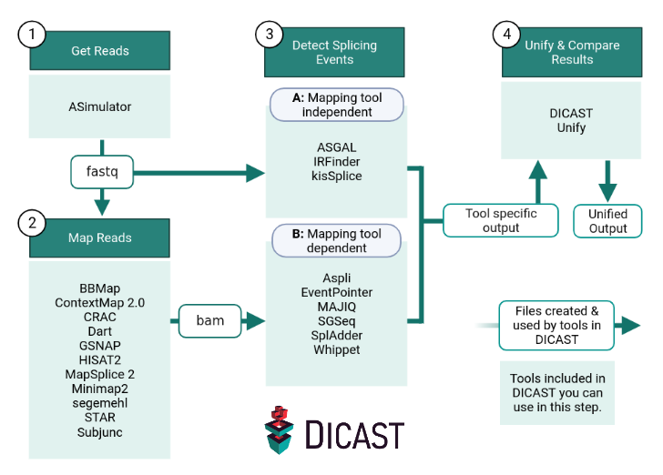

Run your analysis
=================

.. note::

  This guide assumes that you have followed all four steps of the :doc:`setup<setup>` carefully.

.. toctree::
   :maxdepth: 2

   run/one_tool
   run/runscript

Workflow
^^^^^^^^

To run the entire pipeline, you need a fasta file and a gtf file of your organism. If you do not want to work with simulated data, you can enter each step with your own data. E.g. you can enter step 2 or 3A with fastq files from your own experiment or step 3B with bam files from your own mapping tool. Please note that not all mapping and splicing detection tools are compatible with each other and have different file requirements (e.g. fasta, gtf, gff). For further information, please refer to the tool-specific DICAST documentation.
