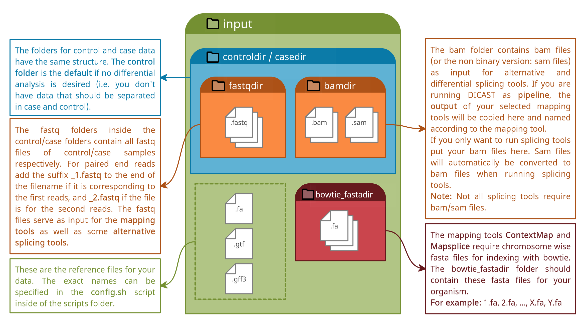

Directory Structure
===================

.. note::

  Our pipeline allows to run many different tools in the same way. The scripts therefore rely on the directory structure specified here.
  Please don't rename any directories that are listed here within the git. An output directory is created with your first run. This directory may be renamed.

Example Tree Structure
^^^^^^^^^^^^^^^^^^^^^^

This is an example for the tree structure when running the pipeline for alternative splicing.
Please note that **you only need a .fa and a .gtf file** if you start your analysis with ASimulator, since it will create .fastq files for you. However, some tools need specific input files. Please refer to the respective :ref:`tool documentation<Tools>` for further information.

.. code:: bash

  input
  ├── casedir
  │   ├── bamdir
  │   └── fastqdir
  ├── controldir
  │   ├── bamdir
  │   │   ├── example_bbmap.sam
  │   │   ├── example_contextmap.sam
  │   │   ├── example_crac.sam
  │   │   ├── example_dart.sam
  │   │   ├── example_gsnap.sam
  │   │   ├── example_hisat.sam
  │   │   ├── example_mapsplice.sam
  │   │   ├── example_minimap.sam
  │   │   ├── example_segemehl.sam
  │   │   ├── example_starAligned.out.sam
  │   │   └── example_subjunc.sam
  │   └── fastqdir
  │       ├── example_1.fastq
  │       └── example_2.fastq
  ├── bowtie_fastadir
  │   ├── 10.fa
  │   ├── 11.fa
  │   ├── 12.fa
  │   ├── 13.fa
  │   ├── 14.fa
  │   ├── 15.fa
  │   ├── 16.fa
  │   ├── 17.fa
  │   ├── 18.fa
  │   ├── 19.fa
  │   ├── 1.fa
  │   ├── 20.fa
  │   ├── 21.fa
  │   ├── 22.fa
  │   ├── 2.fa
  │   ├── 3.fa
  │   ├── 4.fa
  │   ├── 5.fa
  │   ├── 6.fa
  │   ├── 7.fa
  │   ├── 8.fa
  │   ├── 9.fa
  │   ├── MT.fa
  │   ├── X.fa
  │   └── Y.fa
  ├── example.fa
  ├── example.gff
  └── example.gtf

.. toctree::
   :maxdepth: 1
